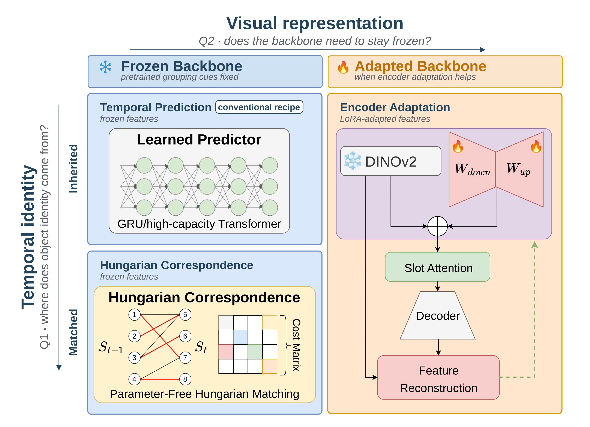
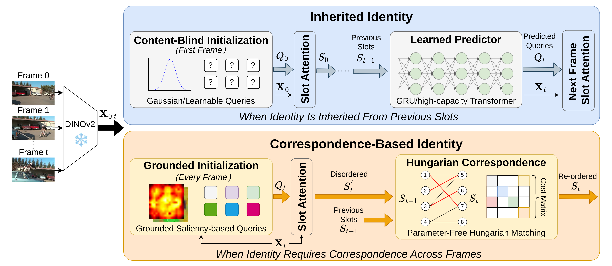
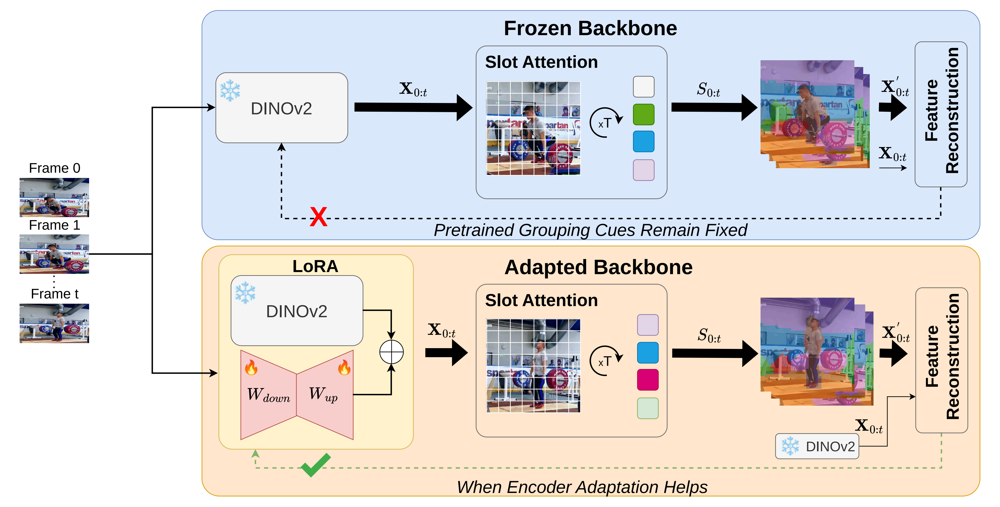
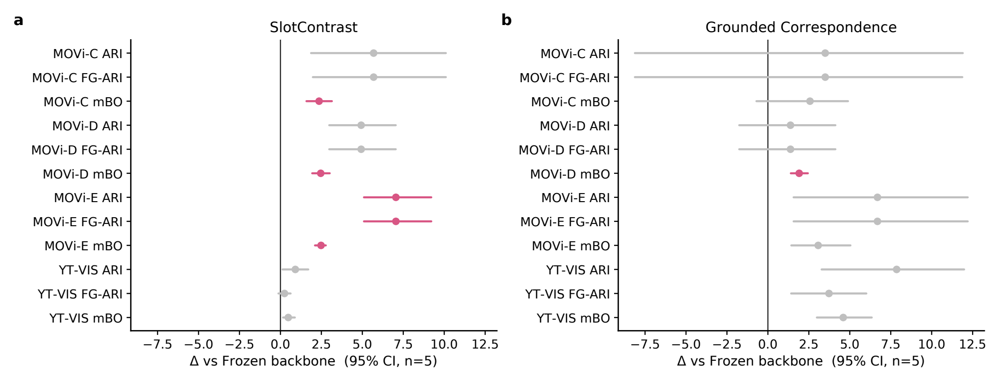
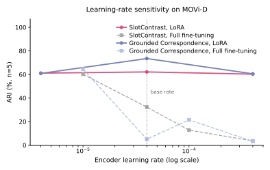

<h1 align="center">Do We Really Need the Default Recipe for<br/>Video Object-Centric Learning?</h1>

<p align="center">
Rethinking two defaults in video object-centric learning — the <b>frozen pretrained backbone</b>
and the <b>learned temporal predictor</b> — across two model families and four video benchmarks.
</p>

<p align="center">
<a href="https://arxiv.org/abs/2605.03650"></a>


<a href="LICENSE"></a>

</p>

> **📢 One codebase, two papers.** This repository accompanies our **ICML 2026** paper
> *Rethinking Temporal Consistency in Video Object-Centric Learning: From Prediction to Correspondence*
> (the **Grounded Correspondence** method, [arXiv:2605.03650](https://arxiv.org/abs/2605.03650)) **and** its
> **IEEE TPAMI** journal extension *Do We Really Need the Default Recipe for Video Object-Centric Learning?*.
> The journal **extends, not replaces** the conference paper: the Grounded Correspondence result stands, and the
> extension adds a second model family, separates temporal prediction from identity propagation, and studies frozen
> vs. adapted backbones under matched settings. See [News](#news).

<p align="center">

</p>

---

## News

**[2026/06]** 🔥 **IEEE TPAMI journal extension released.** Full reproduction code, all experiment configs, the paired-bootstrap statistics pipeline, and figure/table generators are now in this repository.

**[2026/05]** 📄 Conference paper *Rethinking Temporal Consistency in Video Object-Centric Learning: From Prediction to Correspondence* on [arXiv:2605.03650](https://arxiv.org/abs/2605.03650).

**[2026]** 🎉 *Grounded Correspondence* accepted to **ICML 2026**.

---

## Overview

Video object-centric learning decomposes unlabeled videos into object-level representations and preserves object
identity across frames. Two choices have become de facto defaults: a **frozen pretrained backbone** (fixed features
provide grouping cues) and a **learned temporal predictor** (it carries identity from frame to frame). Both can lead to
strong performance — but our results show **neither is always necessary**. We study this through two model families
across four benchmarks (synthetic + real), separating *how object identity is established and preserved* from *how
visual features are adapted*, around two questions (Q1, Q2 above).

**Contributions.**
- [x] Separate **temporal prediction, identity propagation, and correspondence** as distinct mechanisms for preserving object identity.
- [x] Show that **propagation** suffices when identity is inherited from the previous frame, while **correspondence** is required when objects are re-identified independently.
- [x] Revisit the frozen-backbone default: **bounded adaptation** (rank-8 LoRA + feature-reconstruction self-distillation) can improve object discovery without destabilizing grouping cues.
- [x] Identify the common principle: each default is useful precisely when it **preserves a reference the slot model needs** — a source of temporal identity, or pretrained grouping cues.

---

## Q1 — What does temporal consistency require?

<p align="center">

</p>

Temporal consistency depends on **how object identity is established**, not on a fixed choice of learned prediction:

- **Inherited identity** (e.g. SlotContrast, `first_frame` content-blind initialization): slots for later frames inherit
  their identity from the previous frame, so **direct propagation** preserves identity — a learned predictor is not needed.
- **Established by correspondence** (**Grounded Correspondence**, `per_frame` content-based initialization): objects are
  re-identified from each frame and slot order can change, so temporal consistency requires **explicit correspondence**.

### Grounded Correspondence (ICML 2026)

The de facto approach maintains temporal consistency through learned dynamics modules that predict future slot states.
The conference paper shows these predictors function as **expensive approximations of a discrete correspondence
problem**: modern self-supervised backbones already encode instance-discriminative features, so exploiting them removes
the need for learned temporal prediction. **Grounded Correspondence** initializes slots from **saliency peaks in frozen
DINOv2 features** (`S_i = L_i − α·G_i`, local consistency minus background suppression) and maintains frame-to-frame
identity through **parameter-free Hungarian matching** on slot representations — **zero learnable parameters** for
temporal modeling, yet competitive on MOVi-D/E and YouTube-VIS.

| Dataset | Video FG-ARI | Video mBO | Config |
|---|---|---|---|
| MOVi-D | 73.7 | 28.4 | `configs/grounded_correspondence/movi_d.yaml` |
| MOVi-E | 75.7 | 23.4 | `configs/grounded_correspondence/movi_e.yaml` |
| YT-VIS 2021 | 33.1 | 29.3 | `configs/grounded_correspondence/ytvis2021.yaml` |

*Key settings: MOVi-D/E use 15 slots with grounded saliency (α=0.5 for D, α=1.0 for E, spatial radius r=1);
YouTube-VIS uses 7 slots (α=0.5, r=2); temporal identity via Hungarian matching (no learnable parameters).*

---

## Q2 — Does the visual backbone really need to stay frozen?

<p align="center">

</p>

Freezing protects pretrained grouping cues from drift, but it also prevents the encoder from adapting to the
object-centric training signal. The extension studies a **bounded adaptation** protocol — **rank-8 LoRA** on the
attention layers + **feature-reconstruction self-distillation** that ties the adapted encoder to a frozen pretrained
target — and finds adaptation can improve object discovery, with **dataset-dependent** effects.

<p align="center">

</p>
<p align="center"><sub>Per-cell lift of the adaptation recipe over the frozen baseline (paired-bootstrap 95% CI, n=5); highlighted cells exclude 0.</sub></p>

A distinctive property of LoRA-based adaptation is **learning-rate robustness**: naïve full fine-tuning is highly
LR-sensitive and collapses at the canonical encoder LR, whereas LoRA stays competitive across a wide LR range.

<p align="center">

</p>

> The paper reports **architecture- and dataset-conditional** findings with full statistics (paired-bootstrap 95% CIs,
> Holm–Bonferroni correction, TOST equivalence margins) — see the paper for the complete tables.

---

## Installation

```bash
conda env create -f environment.yml      # env "slotcontrast", Python 3.10
conda activate slotcontrast
pip install -e .
```

A single Ampere-or-newer GPU is enough to train one model and to run all evaluation/visualization; the paper's grid was
run on NVIDIA H200. A [Poetry](https://python-poetry.org/) lockfile is also provided (`poetry install`).

## Datasets

Prepare the four datasets with the scripts in `data/` (they write the webdataset shards), then point the code at the
data root with the **`VIDEOSAUR_DATA_DIR`** environment variable (defaults to `./data`; the `--data-dir` flag also
works). Configs reference shards by *relative* path, so no config editing is needed.

```bash
export VIDEOSAUR_DATA_DIR=/path/to/data
bash data/gdrive_download.sh
python data/save_movi.py --level c            # repeat for d, e
python data/extract_movi_validation.py
python data/save_ytvis2021.py
```

See [`data/README.md`](data/README.md) for details.

## Quick start — train one model

```bash
# Grounded Correspondence (ICML 2026): per-frame init + Hungarian matching
python slotcontrast/train.py configs/grounded_correspondence/movi_d.yaml

# Adaptation recipe (TPAMI): frozen DINOv2 + rank-8 LoRA + straight-through
# correspondence predictor + feature-reconstruction self-distillation
python slotcontrast/train.py configs/slotcontrast/app/movi_d_slotcontrast_rescue15k.yaml
```

On Slurm, submit the template (edit its module/conda/partition lines for your cluster):

```bash
sbatch triton_slurm.sh configs/slotcontrast/app/movi_d_slotcontrast_rescue15k.yaml
```

Each run writes per-step metrics to `<output_dir>/metrics/version_0/metrics.csv` and its resolved config to
`<output_dir>/settings.yaml`. SlotContrast cells use `init_mode: first_frame`; Grounded Correspondence cells use
`per_frame`; both use the slot–slot contrastive loss. These are set under `configs/slotcontrast/app/` and
`configs/slotcontrast/snippets/`.

### Inference / visualization

```bash
python slotcontrast/inference.py --config configs/inference/movi_d_gc.yaml   # set checkpoint: in the config
```

For MOVi/YouTube-VIS batch visualization (and metrics), `data/batch_inference.py` loads a trained checkpoint and an
inference config from `configs/inference/`.

## Reproducing the full study

The launchers in `scripts/` build a per-job config (base config × variant snippet) with `scripts/build_100k_snippet.py`
and submit one Slurm job per (variant × dataset × seed). Each launcher **prints what it would submit by default**; pass
`--live` to actually submit, and most accept a `smoke --live` mode for a short 1k-step sanity run.

| Launcher | Reproduces |
|---|---|
| `scripts/launch_full_100k_v2.sh wave1 --live` | main grid: {frozen, learned predictor, straight-through / soft correspondence, no-matching, full fine-tune, no feature-reconstruction} × {SlotContrast, Grounded Correspondence} × {MOVi-C/D/E, YT-VIS}, n=5, 100K — plus feature-reconstruction-weight, LoRA-rank, and unfreeze-step ablations |
| `scripts/launch_frozen_nomatch_controls.sh runs --live` | frozen-backbone single-variable predictor controls |
| `scripts/launch_phase_a.sh` / `launch_phase_b.sh` | parameter-efficient fine-tuning study (LoRA learning-rate sweep; BitFit and last-k partial unfreezing) |
| `scripts/launch_breadth_waves.sh {lastk\|loralr\|mae} --live` | cross-dataset breadth of the above |
| `scripts/launch_cross_backbone_ablation.sh` | DINOv1/v2/v3 and MAE backbones |

> **Porting to your cluster.** Site-specific values are confined to: the launchers and `triton_slurm.sh` (output/save
> root, conda-env path, Slurm partition names), and the analysis scripts (`aggregate_*.py`, `paired_stats.py`,
> `tpami_make_*.py`), which read results from a hard-coded results-root constant near the top — point it at your own run
> directory. Nothing else is site-specific.

## Evaluation and analysis

After the runs finish (final validation = highest-step row of each `metrics.csv`, mean ± std over 5 seeds):

```bash
python scripts/aggregate_all_v2.py          # per-cell mean±std summary
python scripts/aggregate_phase_ab.py        # PEFT study summary
python scripts/paired_stats.py              # paired-bootstrap 95% CI + paired t-test + Holm correction
python scripts/tpami_make_figures.py        # quantitative figures
python scripts/tpami_make_tables.py         # LaTeX result tables
python scripts/tpami_render_fair_montage.py --videos   # qualitative montages + composite videos (GPU)
```

## Repository structure

```
.
├── slotcontrast/      training library (models, modules, data, losses, metrics, train.py, inference.py)
├── configs/
│   ├── grounded_correspondence/   Grounded Correspondence (ICML 2026) configs
│   ├── slotcontrast/  per-dataset configs + app/ (method recipes) + snippets/ (variant-composer inputs)
│   └── inference/     inference / visualization configs
├── scripts/           launchers + aggregation + paired statistics + figure/table generators
├── data/              dataset-preparation scripts (no data shipped)
├── tests/             unit tests
├── triton_slurm.sh    single-run Slurm template
├── environment.yml    conda env  (also: requirements.txt / pyproject.toml / poetry.lock / setup.py)
└── assets/            figures used in this README
```

## Citation

If you find this work useful, please cite the journal extension and/or the conference paper:

```bibtex
@article{li2026defaultrecipe,
  title   = {Do We Really Need the Default Recipe for Video Object-Centric Learning?},
  author  = {Li, Zhiyuan and Zhao, Rongzhen and Yang, Wenyan and Zhao, Wenshuai and
             Solin, Arno and Kannala, Juho and Marttinen, Pekka and Pajarinen, Joni},
  journal = {IEEE Transactions on Pattern Analysis and Machine Intelligence (TPAMI)},
  year    = {2026},
  note    = {Under review}
}

@inproceedings{li2026rethinkingtemporal,
  title     = {Rethinking Temporal Consistency in Video Object-Centric Learning: From Prediction to Correspondence},
  author    = {Li, Zhiyuan and Zhao, Rongzhen and Yang, Wenyan and Zhao, Wenshuai and Marttinen, Pekka and Pajarinen, Joni},
  booktitle = {Proceedings of the 43rd International Conference on Machine Learning (ICML)},
  year      = {2026},
  note      = {arXiv:2605.03650}
}
```

## Acknowledgements

This implementation builds on the public object-centric learning codebases
[VideoSAUR](https://github.com/martius-lab/videosaur) and
[SlotContrast](https://github.com/martius-lab/slotcontrast), and uses
[DINOv2](https://github.com/facebookresearch/dinov2) self-supervised features.

## License

Released under the MIT License — see [`LICENSE`](LICENSE). Some parts are adapted from the codebases above and remain
governed by their respective licenses.
