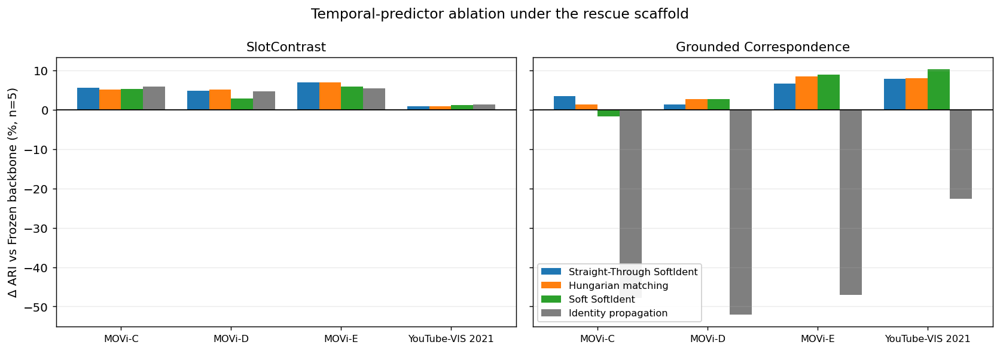
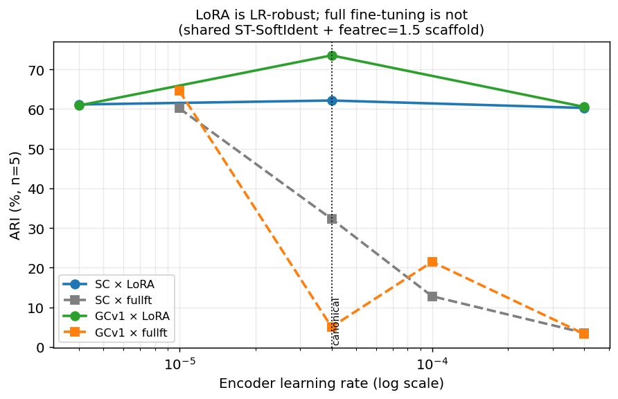
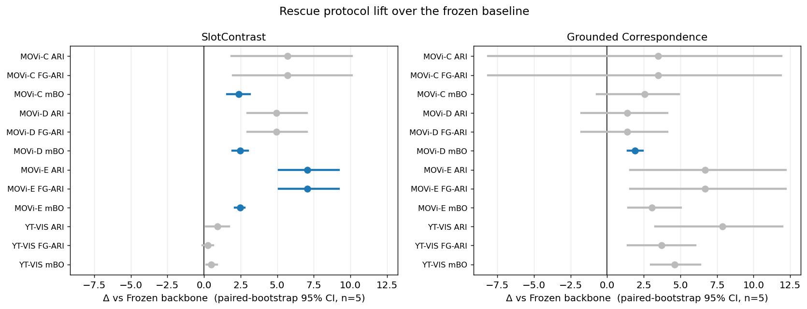

<h1 align="center">Do We Really Need the Default Recipe for<br/>Video Object-Centric Learning?</h1>

<p align="center">
A controlled study of two defaults in video object-centric learning —
the <b>frozen pretrained backbone</b> and the <b>learned temporal predictor</b> —
across two model families and four benchmarks.
</p>

<p align="center">
<a href="https://arxiv.org/abs/2605.03650"></a>


<a href="LICENSE"></a>

</p>

> **📢 Journal extension.** This repository is the **IEEE TPAMI** journal extension of our ICML 2026 paper
> *Rethinking Temporal Consistency in Video Object-Centric Learning: From Prediction to Correspondence*
> ([arXiv:2605.03650](https://arxiv.org/abs/2605.03650)). It **extends, not replaces**, the conference paper:
> the conference result (per-frame initialization + Hungarian matching for Grounded Correspondence) stands,
> and the journal adds a second model family, separates temporal prediction from identity propagation, and
> studies frozen vs. adapted backbones under matched settings. See [News](#news) for the changelog.

<p align="center">

</p>

---

## News

**[2026/06]** 🔥 **Journal (IEEE TPAMI) extension released.** Full reproduction code, all experiment configs, the paired-bootstrap statistics pipeline, and figure/table generators are now in this repository. See [Reproducing the experiments](#reproducing-the-experiments).

**[2026/05]** 📄 Conference paper *Rethinking Temporal Consistency in Video Object-Centric Learning: From Prediction to Correspondence* available on [arXiv:2605.03650](https://arxiv.org/abs/2605.03650).

**[2026]** 🎉 *Grounded Correspondence* accepted to **ICML 2026**.

<details>
<summary><b>About this release</b></summary>

The conference release lived under `configs/grounded_correspondence/` and the original `Grounded Correspondence` recipe. The journal extension adds, on top of the same training library:

- a second architecture family (**SlotContrast**, `first_frame` learned-token initialization with a slot–slot contrastive loss) alongside **Grounded Correspondence** (`per_frame` content-based initialization with Hungarian matching);
- the **temporal-predictor controls** (learned predictor, straight-through / soft correspondence, identity propagation, no-matching);
- the **backbone-adaptation protocol** (rank-8 LoRA + feature-reconstruction self-distillation) and its ablations;
- the **analysis pipeline** (`scripts/`): per-cell aggregation, paired-bootstrap CIs with Holm–Bonferroni correction, and the figure/table generators used in the paper.

</details>

---

## Overview

Video object-centric learning decomposes unlabeled videos into object-level representations and preserves object
identity across frames. Two choices have become de facto defaults: a **frozen pretrained backbone** (fixed features
provide grouping cues) and a **learned temporal predictor** (it carries identity from frame to frame). Both can lead to
strong performance — but our results show **neither is always necessary**. We study this through two model families
across four benchmarks (synthetic + real), separating *how object identity is established and preserved* from *how
visual features are adapted*, and ask two questions:

- **Q1 — What does temporal consistency actually require?** When identity is **inherited from the previous frame**
  (SlotContrast), direct **propagation** preserves identity without a learned predictor. When objects are
  **re-identified from each frame** independently (Grounded Correspondence), temporal consistency instead requires
  explicit **correspondence** across frames.
- **Q2 — Does the visual backbone really need to stay frozen?** Freezing protects pretrained grouping cues from drift,
  but **adaptation can improve object discovery** *when feature reconstruction ties the adapted encoder to a frozen
  pretrained feature target* — though the benefit is dataset- and training-dependent.

**Contributions.**
- [x] Separate **temporal prediction, identity propagation, and correspondence** as distinct mechanisms for preserving object identity.
- [x] Show that **propagation** suffices when identity is inherited, while **correspondence** is required when objects are re-identified independently.
- [x] Revisit the frozen-backbone default: **bounded adaptation** (rank-8 LoRA + feature-reconstruction) can improve object discovery without destabilizing grouping cues.
- [x] Identify the common principle: each default is useful precisely when it **preserves a reference the slot model needs** — a source of temporal identity, or pretrained grouping cues.

---

## Installation

```bash
conda env create -f environment.yml      # env "slotcontrast", Python 3.10
conda activate slotcontrast
pip install -e .
```

A single Ampere-or-newer GPU is enough to train one model and to run all evaluation/visualization; the paper's grid
was run on NVIDIA H200. (A [Poetry](https://python-poetry.org/) lockfile is also provided: `poetry install`.)

## Datasets

Prepare the four datasets with the scripts in `data/` (they write the webdataset shards), then point the code at the
data root with the **`VIDEOSAUR_DATA_DIR`** environment variable (defaults to `./data`). Configs reference shards by
*relative* path (e.g. `movi_d/movi_d-train-*.tar`), so no config editing is needed.

```bash
export VIDEOSAUR_DATA_DIR=/path/to/data
bash data/gdrive_download.sh
python data/save_movi.py --level c            # repeat for d, e
python data/extract_movi_validation.py
python data/save_ytvis2021.py
```

See [`data/README.md`](data/README.md) for details.

## Quick start — train one model

```bash
python slotcontrast/train.py configs/slotcontrast/app/movi_d_slotcontrast_rescue15k.yaml
```

On Slurm, submit the template (edit its module/conda/partition lines for your cluster):

```bash
sbatch triton_slurm.sh configs/slotcontrast/app/movi_d_slotcontrast_rescue15k.yaml
```

Each run writes per-step metrics to `<output_dir>/metrics/version_0/metrics.csv` and its resolved config to
`<output_dir>/settings.yaml`.

**The adaptation recipe** is: frozen DINOv2 backbone + **rank-8 LoRA** on attention layers + a **straight-through
correspondence** slot predictor + **feature-reconstruction self-distillation** (weight 1.5), with the backbone unfrozen
at step 5000. SlotContrast cells use `init_mode: first_frame`; Grounded Correspondence cells use `per_frame`; both use
the slot–slot contrastive loss. These are set in `configs/slotcontrast/app/` and `configs/slotcontrast/snippets/`.

## Reproducing the experiments

The launchers in `scripts/` build a per-job config (base config × variant snippet) with `scripts/build_100k_snippet.py`
and submit one Slurm job per (variant × dataset × seed). Each launcher **prints what it would submit by default**; pass
`--live` to actually submit, and most accept a `smoke --live` mode for a short 1k-step sanity run.

| Launcher | Reproduces |
|---|---|
| `scripts/launch_full_100k_v2.sh wave1 --live` | main grid: {frozen, learned predictor, straight-through / soft correspondence, no-matching, full fine-tune, no feature-reconstruction} × {SlotContrast, Grounded Correspondence} × {MOVi-C/D/E, YT-VIS}, n=5, 100K — plus feature-reconstruction-weight, LoRA-rank, and unfreeze-step ablations |
| `scripts/launch_frozen_nomatch_controls.sh runs --live` | frozen-backbone single-variable predictor controls |
| `scripts/launch_phase_a.sh` / `launch_phase_b.sh` | parameter-efficient fine-tuning study (LoRA learning-rate sweep; BitFit and last-k partial unfreezing) |
| `scripts/launch_breadth_waves.sh {lastk\|loralr\|mae} --live` | cross-dataset breadth of the above |
| `scripts/launch_cross_backbone_ablation.sh` | DINOv1/v2/v3 and MAE backbones |

Composer (used by the launchers; also runnable standalone):

```bash
python scripts/build_100k_snippet.py \
  --base    configs/slotcontrast/app/movi_c_slotcontrast_rescue15k.yaml \
  --variant configs/slotcontrast/snippets/softident_st_fr15.yaml \
  --out     /tmp/run.yaml
```

> **Porting to your cluster.** Site-specific values live in a few places, all easy to edit:
> the launchers and `triton_slurm.sh` (output/save root, conda-env path, Slurm partition names), and the analysis
> scripts in `scripts/` (`aggregate_*.py`, `paired_stats.py`, `tpami_make_*.py`), which read results from a hard-coded
> `ELEC = Path(...)` / results-root constant near the top — point it at your own run directory. Nothing else is
> site-specific.

## Evaluation and analysis

After the runs finish (final validation = highest-step row of each `metrics.csv`, mean ± std over the 5 seeds):

```bash
python scripts/aggregate_all_v2.py          # per-cell mean±std summary
python scripts/aggregate_phase_ab.py        # PEFT study summary
python scripts/paired_stats.py              # paired-bootstrap 95% CI + paired t-test + Holm correction
python scripts/tpami_make_figures.py        # quantitative figures
python scripts/tpami_make_tables.py         # LaTeX result tables
python scripts/tpami_render_fair_montage.py --videos   # qualitative montages + composite videos (GPU)
```

The aggregation, statistics, figure, and table scripts run on the per-run `metrics.csv` files produced by training.
The qualitative montage/video renderer additionally loads trained checkpoints (referenced by a checkpoint manifest),
so point it at your own run directory when reproducing those panels.

## Results

The paper's findings are **architecture- and dataset-conditional** rather than a single leaderboard number; please see
the paper for the full statistics (paired-bootstrap 95% CIs, Holm–Bonferroni correction, TOST equivalence margins). The
figures below are regenerated by the scripts above.

<details open>
<summary><b>Q1 — Temporal predictor ablation under the rescue scaffold</b></summary>

<p align="center"></p>

For **SlotContrast** (inherited identity), every predictor — including pure **identity propagation** — performs within
a narrow band: the learned temporal module is not needed once the initialization already anchors identity. For
**Grounded Correspondence** (per-frame re-identification), removing correspondence (identity propagation) is
**catastrophic** (gray bars), so explicit correspondence is required.

</details>

<details open>
<summary><b>Q2 — Backbone adaptation: LoRA is learning-rate-robust, full fine-tuning is not</b></summary>

<p align="center"></p>
<p align="center"></p>

Bounded **LoRA adaptation** (with feature-reconstruction self-distillation) stays competitive across encoder learning
rates, whereas naïve full fine-tuning collapses at the canonical LR. The forest plot shows the per-cell lift of the
adaptation recipe over the frozen baseline (paired-bootstrap 95% CI, n=5); cells whose CI excludes 0 are highlighted.

</details>

**Conference reference numbers** (Grounded Correspondence, `per_frame` init + Hungarian matching, ViT-B/14 DINOv2):

| Dataset | Video FG-ARI | Video mBO | Config |
|---|---|---|---|
| MOVi-D | 73.7 | 28.4 | `configs/grounded_correspondence/movi_d.yaml` |
| MOVi-E | 75.7 | 23.4 | `configs/grounded_correspondence/movi_e.yaml` |
| YT-VIS 2021 | 33.1 | 29.3 | `configs/grounded_correspondence/ytvis2021.yaml` |

## Repository structure

```
.
├── slotcontrast/      training library (models, modules, data, losses, metrics, train.py, inference.py)
├── configs/
│   ├── slotcontrast/  per-dataset configs + app/ (method recipes) + snippets/ (variant-composer inputs)
│   ├── grounded_correspondence/   conference-version Grounded Correspondence configs
│   └── inference/     inference / visualization configs
├── scripts/           launchers + aggregation + paired statistics + figure/table generators
├── data/              dataset-preparation scripts (no data shipped)
├── tests/             unit tests
├── triton_slurm.sh    single-run Slurm template
├── environment.yml    conda env  (also: requirements.txt / pyproject.toml / poetry.lock / setup.py)
└── assets/            figures used in this README
```

## Citation

If you find this work useful, please cite the journal extension and/or the conference paper:

```bibtex
@article{li2026defaultrecipe,
  title   = {Do We Really Need the Default Recipe for Video Object-Centric Learning?},
  author  = {Li, Zhiyuan and Zhao, Rongzhen and Yang, Wenyan and Zhao, Wenshuai and
             Solin, Arno and Kannala, Juho and Marttinen, Pekka and Pajarinen, Joni},
  journal = {IEEE Transactions on Pattern Analysis and Machine Intelligence (TPAMI)},
  year    = {2026},
  note    = {Under review}
}

@inproceedings{li2026rethinkingtemporal,
  title     = {Rethinking Temporal Consistency in Video Object-Centric Learning: From Prediction to Correspondence},
  author    = {Li, Zhiyuan and Zhao, Rongzhen and Yang, Wenyan and Zhao, Wenshuai and Marttinen, Pekka and Pajarinen, Joni},
  booktitle = {Proceedings of the 43rd International Conference on Machine Learning (ICML)},
  year      = {2026},
  note      = {arXiv:2605.03650}
}
```

## Acknowledgements

This implementation builds on the public object-centric learning codebases
[VideoSAUR](https://github.com/martius-lab/videosaur) and
[SlotContrast](https://github.com/martius-lab/slotcontrast), and uses
[DINOv2](https://github.com/facebookresearch/dinov2) self-supervised features.

## License

Released under the MIT License — see [`LICENSE`](LICENSE). Some parts are adapted from the codebases above and remain
governed by their respective licenses.
